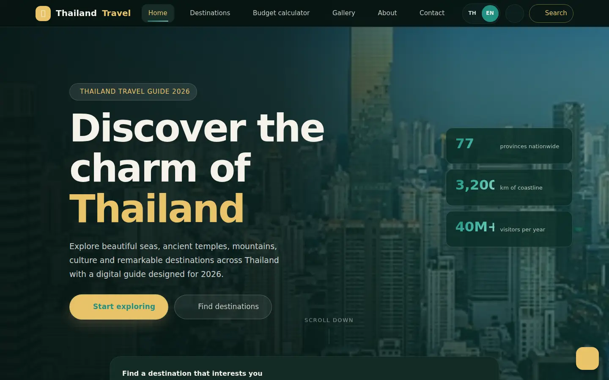

<div align="center">
  <h1>Thailand Travel Guide 2026</h1>
  <p><strong>คู่มือท่องเที่ยวประเทศไทยสองภาษา ครบทั้ง 77 จังหวัด</strong></p>
  <p>A bilingual, responsive tourism portfolio built with vanilla web technologies.</p>
  <p>
    <a href="https://armddzzpluto-ops.github.io/thai-tourism/"><strong>เปิดเว็บไซต์จริง</strong></a>
    ·
    <a href="https://github.com/armddzzpluto-ops/thai-tourism/actions/workflows/site-checks.yml">ดูผลการทดสอบ</a>
    ·
    <a href="docs/TODO.md">แผนพัฒนาต่อ</a>
  </p>
  <p>
    <a href="https://github.com/armddzzpluto-ops/thai-tourism/actions/workflows/site-checks.yml">
      
    </a>
  </p>
</div>

## ภาพตัวอย่าง

<table>
  <tr>
    <th width="70%">Desktop · Dark Mode · 1440×900</th>
    <th width="30%">Mobile · Light Mode · 390×844</th>
  </tr>
  <tr>
    <td></td>
    <td></td>
  </tr>
</table>

## เกี่ยวกับโปรเจกต์

Thailand Travel Guide 2026 เป็นโครงงาน Portfolio ระดับ ปวส. สาขาเทคโนโลยีธุรกิจดิจิทัล ออกแบบให้ผู้ใช้สำรวจข้อมูลตัวแทนการท่องเที่ยวครบ 77 จังหวัดผ่านเว็บแบบ Static ที่ใช้งานได้ทั้งคอมพิวเตอร์ แท็บเล็ต และโทรศัพท์ โดยไม่ต้องมี Backend

โปรเจกต์เน้นข้อมูลชุดกลางเดียวกัน การแสดงผลไทย–อังกฤษ การเข้าถึงด้วยคีย์บอร์ด และการทดสอบพฤติกรรมจริงในหลายขนาดหน้าจอ

## จุดเด่นและฟีเจอร์

- ครอบคลุมจังหวัดของประเทศไทยครบ **77 จังหวัด** พร้อม URL รายจังหวัดที่แชร์และเปิดซ้ำได้
- เปลี่ยนภาษา **ไทย–อังกฤษ** แบบทันทีโดยไม่ต้องโหลดหน้าใหม่
- รองรับ **Light Mode / Dark Mode** และบันทึกค่าที่ผู้ใช้เลือกไว้
- ค้นหาและกรองจุดหมายตามภูมิภาค หมวดหมู่ และรายการโปรด
- บันทึกจุดหมายโปรดด้วย `localStorage`
- แกลเลอรีภาพจังหวัดพร้อม Modal, Keyboard navigation และข้อความกำกับภาพ
- ผู้ช่วยวางแผนทริปแบบข้อความที่เข้าใจภูมิภาค จำนวนวัน ความสนใจ และงบประมาณ โดยประมวลผลในเบราว์เซอร์โดยไม่ใช้ API ภายนอก
- ตัวอย่างเส้นทางอีสานใต้ 5 วันแบบรายวัน อ้างอิงจากการท่องเที่ยวแห่งประเทศไทยและเชื่อมต่อคู่มือจังหวัดในโครงการ
- เครื่องคำนวณงบเดินทางจากตัวเลขที่ผู้ใช้กรอกเอง
- Dashboard แสดงความครอบคลุมของชุดข้อมูลเว็บไซต์ด้วย Chart.js
- รองรับ Direct URL, Refresh, Back/Forward และ Hash navigation
- Responsive และทดสอบบน Desktop, Notebook, Tablet และ Mobile
- มี Canonical URL, Open Graph, JSON-LD และ `sitemap.xml` สำหรับหน้ารายจังหวัด

## เส้นทางหลักของเว็บไซต์

| หน้า | ความสามารถหลัก |
|---|---|
| Home | ภาพรวม ค้นหาด่วน จังหวัดแนะนำ และตัวช่วยสำรวจ |
| Destinations | ค้นหา กรองภูมิภาค และแสดงเฉพาะรายการโปรด |
| Trip planner (`#promotions`) | วางแผนเส้นทางจากข้อความ ดูแหล่งอ้างอิง และคำนวณงบจากตัวเลขที่ผู้ใช้กรอก |
| Gallery | ดูภาพจังหวัดและเปิด Lightbox |
| Dashboard | ดูความครอบคลุมของข้อมูลภายในเว็บไซต์ |
| About | เป้าหมาย ขอบเขต และเทคโนโลยีของโครงงาน |
| Contact | แบบฟอร์มสาธิต Validation และช่องทาง GitHub |

## สถานะข้อมูลอย่างโปร่งใส

> เว็บไซต์นี้เป็นโครงงานเพื่อการศึกษา ไม่ใช่ผู้ให้บริการท่องเที่ยวหรือระบบจองจริง

| ขอบเขตข้อมูล | สถานะ ณ 15 สิงหาคม 2026 |
|---|---:|
| จังหวัดในชุดข้อมูลกลาง | 77/77 |
| หน้ารายละเอียดจังหวัดที่สร้างล่วงหน้า | 77/77 |
| จังหวัดที่มีภาพแกลเลอรีคัดสรรอย่างน้อย 3 ภาพ | 77/77 |
| จังหวัดที่มีข้อมูลสถานที่เชิงลึกพร้อมแหล่งอ้างอิง | 5/77 |
| จังหวัดที่รอตรวจสอบข้อมูลสถานที่เชิงลึก | 72/77 |

จังหวัดที่ตรวจสอบแหล่งอ้างอิงเชิงลึกแล้ว ได้แก่ **กรุงเทพมหานคร เชียงใหม่ ภูเก็ต กระบี่ และสุราษฎร์ธานี** ส่วนจังหวัดอื่นจะแสดงสถานะรอตรวจสอบแทนการสร้างเวลาเปิด–ปิด ค่าเข้าชม พิกัด หรือข้อเสนอจากผู้ให้บริการขึ้นเอง

เส้นทางตัวอย่างอีสานใต้ 5 วันเป็นข้อมูลระดับแผนการเดินทางที่แยกจากสถานะสถานที่เชิงลึก 5/77 โดยอ้างอิง [เส้นทางบุรีรัมย์–ศรีสะเกษ–อุบลราชธานี 5 วันของ ททท.](https://www.tourismthailand.org/Trip-Planner/Suggestion-Detail/buri-ram-si-sa-ket-ubon-ratchathani-5-days) ผู้ใช้ยังต้องตรวจสอบเวลาเปิด ค่าเข้าชม สภาพอากาศ และการเดินทางล่าสุดก่อนเดินทางจริง

ติดตามรายละเอียดล่าสุดได้ที่ [`docs/AI_MEMORY.md`](docs/AI_MEMORY.md) และ [`docs/TODO.md`](docs/TODO.md)

## เทคโนโลยีที่ใช้

| กลุ่ม | เทคโนโลยี |
|---|---|
| Frontend | HTML5, CSS3, Vanilla JavaScript |
| Data visualization | Chart.js 4.4.1 |
| Browser testing | Playwright |
| Quality checks | Node.js scripts, GitHub Actions |
| Hosting | GitHub Pages |
| Client storage | Web Storage API (`localStorage`) |

ไม่มี Framework, Backend หรือฐานข้อมูลฝั่ง Server เพื่อให้โปรเจกต์เปิดใช้งานและนำขึ้น GitHub Pages ได้โดยตรง

## วิธีเปิดเว็บไซต์ในเครื่อง

### วิธีที่ง่ายที่สุดใน VS Code

1. Clone หรือดาวน์โหลด Repository นี้
2. เปิดโฟลเดอร์ `thai-tourism` ด้วย VS Code
3. ติดตั้ง Extension **Live Server**
4. คลิกขวา `index.html` แล้วเลือก **Open with Live Server**

### ใช้ Terminal

```bash
git clone https://github.com/armddzzpluto-ops/thai-tourism.git
cd thai-tourism
python -m http.server 5500
```

จากนั้นเปิด `http://localhost:5500` หากใช้ Windows และคำสั่ง `python` ไม่ทำงาน ให้ใช้ `py -m http.server 5500`

## วิธีติดตั้งและรันทดสอบ

แนะนำ Node.js 22 เพื่อให้ตรงกับ GitHub Actions

```bash
npm ci
npm run verify
```

คำสั่งที่มีให้ใช้งาน:

| คำสั่ง | หน้าที่ |
|---|---|
| `npm run check` | ตรวจโครงสร้าง ข้อมูล ลิงก์ และไฟล์ที่เว็บไซต์อ้างอิง |
| `npm run test:e2e` | รัน Playwright บน 4 ขนาดหน้าจอ |
| `npm run verify` | รัน Structural checks และ Browser tests ต่อเนื่องกัน |
| `npm run build:destinations` | สร้างหน้ารายจังหวัดทั้ง 77 จังหวัดและ Sitemap ใหม่ |

## โครงสร้างโปรเจกต์

```text
thai-tourism/
├── index.html                 # SPA shell และหน้าหลักทั้ง 7 เส้นทาง
├── css/                       # Design tokens, layout และ responsive styles
├── js/
│   ├── app.js                 # Routing, rendering และ interactions
│   ├── data.js                # ข้อมูลจังหวัดและสถานที่ชุดกลาง
│   ├── translations.js        # ข้อความไทย–อังกฤษ
│   └── i18n.js                # ระบบภาษาและการอัปเดต UI
├── assets/images/provinces/   # ภาพที่เว็บไซต์ใช้งานจริง
├── destinations/              # หน้ารายละเอียดที่สร้างล่วงหน้า 77 จังหวัด
├── scripts/
│   ├── build/                 # สร้างหน้ารายจังหวัดและ Sitemap
│   ├── quality/               # Structural regression checks
│   └── maintenance/           # งานบำรุงรักษาเอกสารโครงการ
├── tests/                     # Playwright acceptance tests
├── docs/                      # Memory, TODO และภาพประกอบ README
└── .github/workflows/         # GitHub Actions
```

## แนวทางพัฒนาต่อ

1. ตรวจสอบข้อมูลสถานที่ที่เหลือ 72 จังหวัดเป็น Batch ขนาดเล็ก พร้อมแหล่งอ้างอิง
2. เพิ่มพิกัดเฉพาะเมื่อมีแหล่งข้อมูลที่เชื่อถือได้
3. เพิ่ม Visual Regression ก่อนรวม CSS ที่ซ้ำกัน
4. ตรวจ Performance หลังงานข้อมูลเสร็จสมบูรณ์

รายละเอียดทั้งหมดอยู่ใน [`docs/TODO.md`](docs/TODO.md)

---

<div align="center">
  <strong>Thailand Travel Guide 2026</strong><br>
  Educational portfolio · Digital Business Technology
</div>
